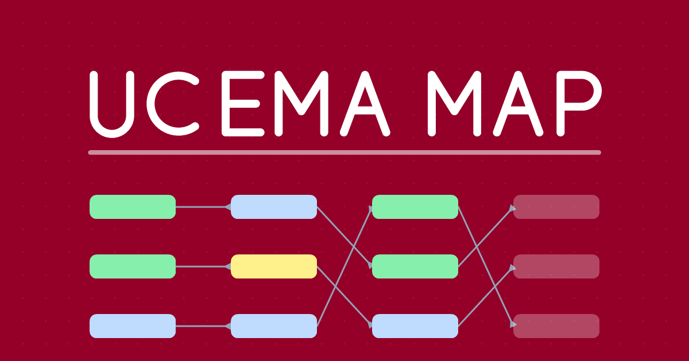

<div align="center">


# UCEMA Map

**El mapa de correlatividades de tu carrera, con tu avance encima.**

Marcá lo que aprobaste y el grafo te muestra qué se te habilita, qué te falta y cómo venís con el promedio.

### [→ Abrir UCEMA Map](https://ucemap.vercel.app)



</div>

---

## Qué hace

| | |
|---|---|
| **Mapa de correlatividades** | El plan completo como grafo, ordenado por año y cuatrimestre. Al tocar una materia se iluminan sus correlativas y lo que habilita. |
| **Importar tus notas** | Copiás la página de *Notas oficiales* del sistema de alumnos y la pegás: se cargan solas todas tus materias con su nota. Es la forma más rápida de arrancar. |
| **¿Qué puedo cursar?** | Ilumina solo las materias que ya podés anotarte, con las correlativas cumplidas. |
| **Estados y notas** | Aprobada, cursando o aplazada, con la nota de cada una (incluida "AP") y el promedio calculado en vivo. |
| **Progreso por bloque** | Obligatorias, electivas, proyecto final y requisitos, cada uno con su avance. |
| **Buscador** | `Ctrl` / `⌘` + `K` para encontrar cualquier materia y centrar el mapa en ella. |
| **Tu progreso en tu Drive** | Sesión con Google opcional: el mapa se guarda en tu propia cuenta y lo abrís desde cualquier dispositivo. |
| **Instalable y offline** | Es una PWA: se instala como app en el celular y funciona sin conexión. |
| **Modo oscuro y mobile** | Pensada para usarse en el teléfono, con gestos y layout propios. |

## Carreras

Las 12 carreras de grado, con sus planes vigentes:

| | |
|---|---|
| Ingeniería en Informática | Licenciatura en Economía |
| Abogacía | Licenciatura en Finanzas |
| Actuario | Licenciatura en Marketing |
| Business Administration | Licenciatura en Negocios Digitales |
| Contador Público | Licenciatura en Relaciones Internacionales |
| Licenciatura en Ciencias Políticas | Licenciatura en Dirección de Empresas |

> **No es un sitio oficial de la Universidad del CEMA.** Los datos se transcriben de los planes de
> estudio oficiales y están verificados uno por uno contra ellos, pero pueden tener errores o quedar
> desactualizados. Antes de inscribirte a una materia, confirmá con la universidad.
> Si ves algo mal, el panel de cada materia tiene un link para reportarlo.

## Tus datos

- **Sin iniciar sesión** no se guarda nada: lo que marques vive en la pestaña y se pierde al recargar.
- **Con sesión de Google**, el progreso va a `appDataFolder`: una carpeta oculta de **tu** Drive que
  solo esta aplicación puede ver. No hay servidor ni base de datos: la app habla directamente con
  Google desde tu navegador, y nadie más puede leer tu mapa.
- Los permisos que se piden son el mínimo: crear el archivo de la app y ver tu nombre y correo.

Más detalle en [privacidad](https://ucemap.vercel.app/privacidad) y [condiciones](https://ucemap.vercel.app/terminos).

## Stack

React 19 · TypeScript · Vite · [React Flow](https://reactflow.dev) para el grafo · Zustand para el
estado · Tailwind CSS v4 · React Router · `vite-plugin-pwa`. Deploy en Vercel.

Sin backend: los planes son JSON estáticos que viajan con la app, y la sincronización usa el Drive
del propio usuario a través de Google Identity Services.

## Estructura

```
data/carreras/       Un JSON por carrera + index.json (el registro) + schema.json
scripts/             Validación de datos, generación de íconos/SEO y parsers de PDF
src/
  api → lib/         googleDrive.ts: login y sincronización con Drive
  components/
    graph/           El grafo: nodos, leyenda, menú contextual
    layout/          Header y contenedor de la app
    ui/              Panel de materia, barra de progreso, importador, buscador, tour
  config/theme.ts    Colores (claro/oscuro), branding y medidas del layout
  pages/             Welcome (elegir carrera), MapPage y páginas legales
  store/             Zustand: progreso, sesión, tema y watcher de sincronización
  utils/             Layout del grafo, estado de materias, cadena de correlativas,
                     importación de notas
```

## Correr el proyecto

Requiere Node 20 o superior.

```bash
npm install
npm run dev
```

Para probar el login con Google, copiá `.env.example` a `.env` y completá `VITE_GOOGLE_CLIENT_ID`
con un OAuth Client ID propio (tipo *Web application*, con `http://localhost:5173` entre los
orígenes autorizados). Sin esa variable la app funciona igual, pero sin sincronización.

| Comando | Qué hace |
|---|---|
| `npm run dev` | Servidor de desarrollo |
| `npm run validate` | Valida los JSON de carreras |
| `npm run build` | Valida, genera el sitemap, type-checkea y buildea a `dist/` |
| `npm run preview` | Sirve el build (es la única forma de probar la PWA) |
| `node scripts/generate-icons.mjs` | Regenera favicon, íconos de la PWA y og-image |

## Los datos de las carreras

Cada carrera es un JSON en `data/carreras/`, con esta forma:

```jsonc
{
  "id": "ingenieria-informatica",
  "nombre": "Ingenieria en Informatica",
  "plan": "2026/00",
  "anios": 5,
  "topicos_requeridos": 2,
  "materias": [
    {
      "nro": 1811,              // ID único, sale del plan oficial
      "nombre": "Análisis Matemático I",
      "anio": 1,
      "cuatrimestre": 1,        // 1 o 2
      "grupo": "obligatoria",   // obligatoria | topico | taller | tesis | requisito
      "correlativas": [],       // nros que hay que tener aprobados
      "creditos": 1
    }
  ]
}
```

`npm run validate` corre dentro del build y frena el deploy si algo no cierra: campos faltantes,
`nro` duplicados, correlativas que apuntan a materias inexistentes, ciclos de correlatividades
(dejarían materias bloqueadas para siempre) o cupos de electivas imposibles.

### Regenerar desde los planes oficiales

Los PDF de los planes **no están en el repositorio**: son material que la universidad le entrega a
sus alumnos. Para regenerar o verificar los datos hay que conseguirlos y ponerlos en
`docs/planes-de-estudio/`.

```bash
pip install pymupdf
python scripts/generate_carreras.py        # genera los JSON desde los PDF
python scripts/verificar_contra_pdfs.py    # compara cada JSON contra su plan
npm run validate
```

El verificador reporta materias que falten, correlativas del plan que no se estén mostrando y
correlativas que el plan no respalde. Al día de hoy las 12 carreras coinciden con sus planes.

Ver [scripts/README.md](scripts/README.md) para el detalle de cada herramienta.

## Agregar una carrera

1. Conseguir el PDF del plan y ponerlo en `docs/planes-de-estudio/`.
2. Generar el JSON con `scripts/generate_carreras.py`.
3. Registrarla en `data/carreras/index.json`.
4. Correr `npm run validate` y `python scripts/verificar_contra_pdfs.py`.

## Contribuir

Las correcciones de datos son las más valiosas: si conocés bien el plan de tu carrera y ves una
correlatividad mal, abrí un issue o mandá un pull request. Para cambios de código, contá antes en un
issue qué querés hacer.

---

<div align="center">

Hecho por [Tomás Bruner](https://github.com/Tomib20), alumno de Ingeniería en Informática de la UCEMA.

[Instagram](https://www.instagram.com/tomi.bruner/) ·
[LinkedIn](https://www.linkedin.com/in/tomasbruner) ·
[ucemap.vercel.app](https://ucemap.vercel.app)

</div>
